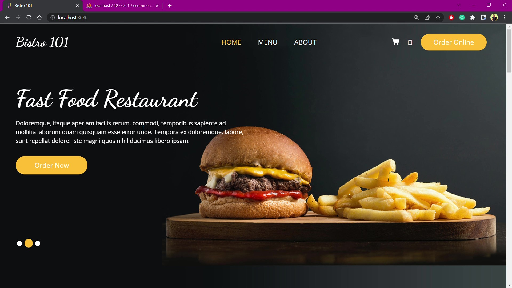
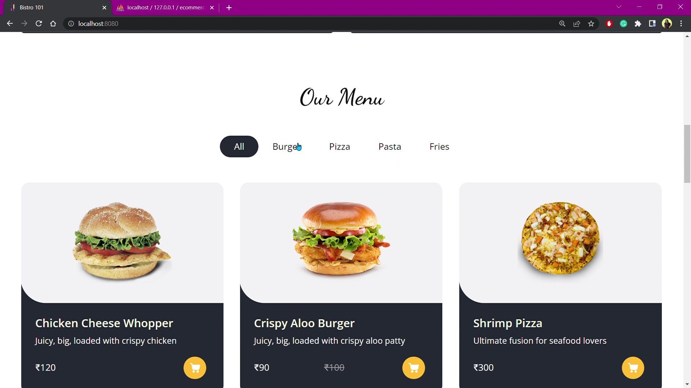
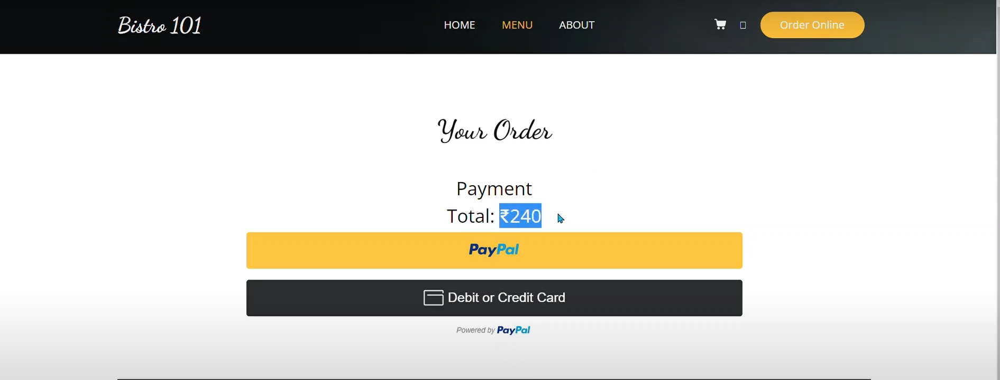

# eCommerce-site-using-Node.js

Bistro 101: An ecommerce website for online fast food restaurant.

## Home page

## Menu

## Checkout

## Payment Module

This has been achieved using [PayPal API](https://developer.paypal.com/home)

------------

## Tech Used:
- ### Languages
  - HTML
  - CSS (Bootstrap)
  - Javascript
  
- ### Tech and Tools
  - XAMPP
  - Node.js
  - Express.js
  - PayPal REST API
  
-------------

# Checkout Demo Video Here:

